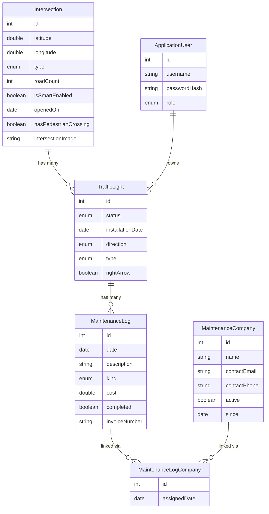
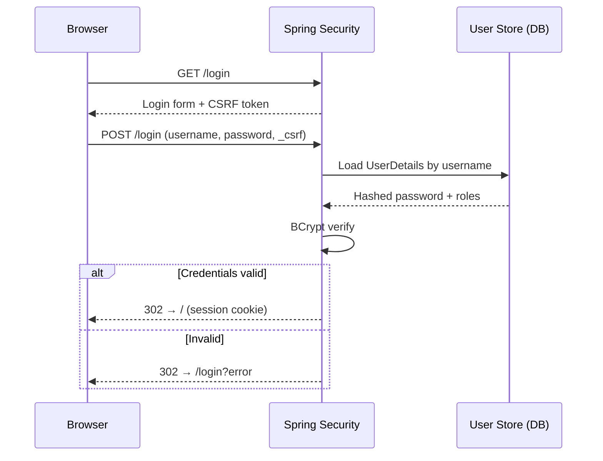
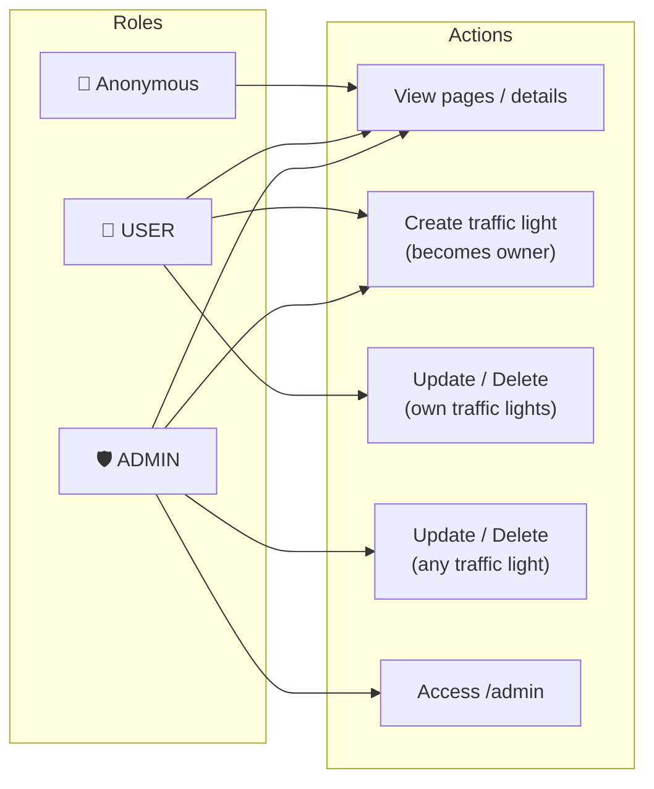
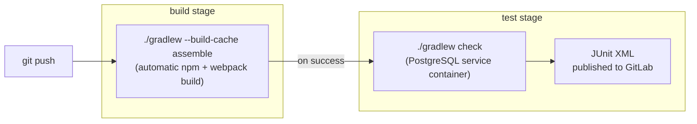
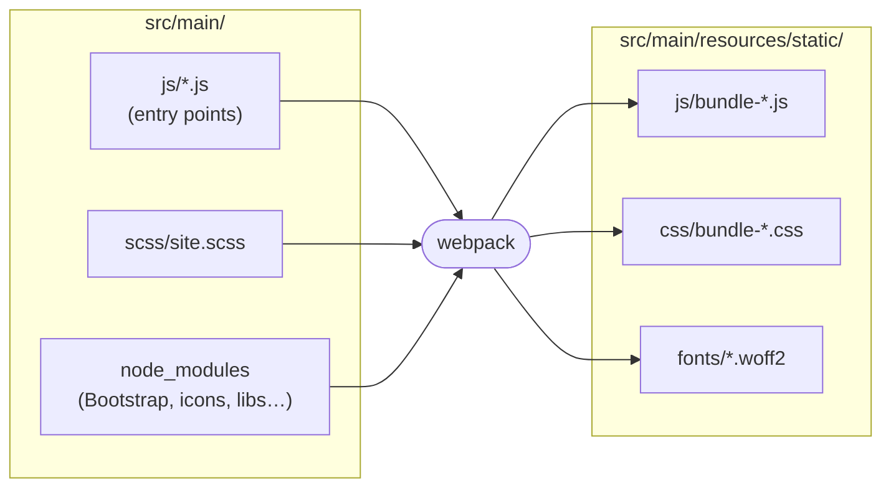

# Traffic Lights Management System

**Author:** Paweł Ryfiak ACS202
**Email:** pawel.ryfiak@student.kdg.be
**Course:** Programming 5

---

## 📚 Documentation

- [Domain Model](docs/DOMAIN.md)
- [Architecture & Project Structure](docs/ARCHITECTURE.md)
- [Setup & Getting Started](docs/SETUP.md)
- [REST API](docs/API.md)

---

## 🌟 Overview

A web application for managing traffic lights, intersections, maintenance schedules, and maintenance companies in an urban traffic control system.

The system allows users to:
- View and manage all traffic lights across the city
- Track intersections and their connected traffic lights
- Schedule and record maintenance activities
- Manage relationships with maintenance companies

### Domain Model



### Application Architecture


---

## 📸 Application Screenshots

### Home Page


### Traffic Lights Management


### Filtering & Details


---

## Week 2

GET and DELETE REST endpoints for traffic lights. See [REST API — Week 2](docs/API.md#week-2--get--delete-endpoints).

---

## Week 3

POST and PATCH REST endpoints for traffic lights with validation and AJAX integration. See [REST API — Week 3](docs/API.md#week-3--post--patch-endpoints).

---

## Week 4

Spring Security with form-based login, BCrypt password hashing, and content-based authorization.

### Authentication Flow



### Users

| Username | Password   | Role    |
|----------|------------|---------|
| `admin`  | `admin123` | `ADMIN` |
| `user1`  | `user123`  | `USER`  |
| `user2`  | `user123`  | `USER`  |

### Pages

- 🌍 **Public page** (accessible by anyone): [Traffic Light Details](http://localhost:8080/trafficLight/1)
  - Anonymous users see basic traffic light info and a teaser prompting login to view the maintenance history.
  - Authenticated users see the full maintenance log section.
- 🌍 **Public page with AJAX data**: [Intersection Details](http://localhost:8080/intersection/1)
  - Anonymous users can load the related traffic-light cards.
  - Creating, updating and deleting traffic lights still requires authentication.
- 🔒 **Authenticated page** (login required): [Traffic Lights List](http://localhost:8080/trafficLights)

---

## Week 5

Complex authorization: roles (ADMIN/USER) + ownership-based permissions on traffic lights.

### Authorization Matrix



### Role overview (including anonymous)

- **Anonymous (not logged in)**
  - Can visit the landing page and traffic light/intersection details.
  - Cannot create, update or delete traffic lights through the browser-session management flow.
  - Can use the dedicated Week 10 standalone client endpoint to create a maintenance company.
- **USER**
  - Can create new traffic lights (the creator becomes the owner).
  - Can update/delete only traffic lights they own.
- **ADMIN**
  - Can update/delete any traffic light.
  - Can access the admin-only page.

### Verification links

- Public page: [Traffic Light Details](http://localhost:8080/trafficLight/1)
- Admin-only page: [Admin](http://localhost:8080/admin)
- Ownership rules (example): [Traffic Light Details #1](http://localhost:8080/trafficLight/1)
  - The details page shows the traffic light owner.
  - Delete actions are hidden unless you are the owner or an admin.

### CSRF + REST/Ajax

CSRF protection is enabled.

- MVC forms include CSRF tokens automatically.
- Ajax calls to the REST API read the CSRF token + header name from Thymeleaf meta tags and send it as a request header
   (Spring typically uses `X-CSRF-TOKEN`, but the client uses the server-provided header name).
- Only `POST /api/public/maintenance-companies` is exempt from CSRF protection. This endpoint supports the separate
  Week 10 standalone client project, which does not use the browser-session management flow.

---

## Week 6

Spring profiles for test isolation and integration tests for the repository and service layers.

### Spring profiles

| Profile | Database | Seeding | Purpose |
|---------|----------|---------|---------|
| *(default)* | PostgreSQL `localhost:9432/programming5` | `data.sql` | Local development |
| `test` | PostgreSQL `localhost:9433/programming5_test` | `TestHelper`, lifecycle methods, or Arrange | Automated tests |

The `test` profile (`application-test.properties`) disables `data.sql` via `spring.sql.init.mode=never` and uses `ddl-auto=create-drop` so every test run starts with a clean schema. Persistence-backed tests seed their own data with `TestHelper` and clean it up after each test.

The test database host is configurable via the `CI_DB_HOST_PORT` environment variable (defaults to `localhost:9433`), so the same profile works locally and in CI without recreating the development schema.

---

## Week 8 & 9

Presentation-layer tests and CI pipeline.

### Running all tests

Make sure Docker is running and the test database container is up before executing:

```bash
docker-compose up -d
```

Then run all tests with a single command:

```bash
# Windows
.\gradlew.bat test

# Linux / macOS
./gradlew test
```

The `test` Spring profile is activated automatically via `@ActiveProfiles("test")` on every Spring-backed test class — no extra flags needed.

Test reports are generated at `build/reports/tests/test/index.html`.

### Test classes

| Category | Class | Tests |
|---|---|---|
| API controller unit tests (mocked dependencies) | `TrafficLightsControllerUnitTest` | CRUD responses, validation failures and unauthenticated `401` responses |
| API controller integration tests (real dependencies) | `IntersectionsControllerTest`, `PublicMaintenanceCompaniesControllerTest` | Public intersection traffic-light cards (`200`, `204`, `404`) and persisted standalone-client creation with validation failures |
| Public API security tests (mocked dependencies) | `PublicTrafficLightsControllerTest` | Read-only public endpoint and unauthenticated write rejection |
| MVC controller integration tests (real dependencies) | `TrafficLightMvcControllerTest` | `GET /trafficLights?status` (200 with filter, 302 redirect), `GET /trafficLight/{id}` (200 found, 200 not-found error view) |
| MVC authorization tests | `HomeControllerTest`, `AdminControllerTest` | Anonymous Quick Add visibility, admin-only CSV upload and copied upload bytes |
| Service unit tests (mocking + verify) | `TrafficLightServiceUnitTest` | `getAllTrafficLights` (list, empty, verify repo call), `getTrafficLightById` (found, not-found, verify ID arg) |
| Role verification tests | `TrafficLightServiceIntegrationTest` | `deleteTrafficLight` (owner ✓, admin ✓, non-owner ✗, not-found ✗), `updateTrafficLight` (owner ✓, admin ✓, non-owner ✗, not-found ✗) |
| Repository tests | `TrafficLightRepositoryTest`, `IntersectionRepositoryTest` | Foreign keys, nullability, lazy vs eager loading and owner fetching |
| Relationship deletion integration tests | `IntersectionDeletionServiceIntegrationTest`, `MaintenanceRelationshipDeletionServiceIntegrationTest` | Cascade cleanup while preserving entities outside the deleted relationship |
| Week 12 tests | `CsvImportServiceTest`, `TrafficLightCacheTest` | CSV row handling and cache eviction after raw additions |

### CI Pipeline

The project uses a GitLab CI pipeline defined in `.gitlab-ci.yml` with two stages:

- **build** — assembles the application with Gradle's build cache (`./gradlew --build-cache assemble`); `processResources` automatically installs frontend dependencies and runs webpack
- **test** — runs Gradle verification against a PostgreSQL service container (`./gradlew check`) and publishes JUnit XML results to the GitLab Tests tab



**Hand-in step:** add a Markdown link to the test report from a recent successful GitLab pipeline.

### Gradle test report


---

## Week 10 & 11

Frontend integration: npm, webpack, and a rich client-side library stack served by Spring Boot.

### Setup

Gradle downloads Node.js 20.19.1 automatically, so a system-wide Node.js installation is not required.
The first frontend build needs network access to download Node.js and npm dependencies.

```bash
# Build all webpack bundles (installs dependencies automatically)
./gradlew npm_run_build

# Lint JavaScript source files
./gradlew npm_run_lint

# Check code formatting (dprint)
./gradlew npm_run_format
```

On Windows, replace `./gradlew` with `.\gradlew.bat`.

### Webpack build pipeline



The normal Gradle build automatically runs `npm_run_build` before copying Spring resources.
That task also runs `npmInstall` when needed, so a separate installation command is unnecessary.

### Frontend library stack

| Package | Purpose |
|---|---|
| **Bootstrap 5** | Responsive grid, components, and utility classes |
| **Bootstrap Icons** | SVG icon set (traffic light, navigation, edit, delete, status indicators) |
| **@popperjs/core** | Tooltip/popover positioning — peer dependency for Bootstrap JS |
| **anime.js** | Fade-in + slide-up animation for dashboard cards on the home page |
| **dayjs** | Compact date formatting in intersection-details traffic light cards |
| **flatpickr** | Cross-browser calendar date-picker on all form pages (replaces `<input type="date">`) |
| **Quill** | Snow-themed rich-text editor for the maintenance log description field |
| **validator.js** | `isFloat` range checks for latitude/longitude on the add-intersection form |

### Webpack entry points

Each entry generates one `.js` bundle and (where CSS is imported) one `.css` bundle under `src/main/resources/static/`:

| Entry | Loaded on |
|---|---|
| `bundle-site` | Every page — Bootstrap, Bootstrap Icons, shared SCSS, dashboard card animation (anime.js) |
| `bundle-form-validation` | All form pages — flatpickr date pickers + validator.js coordinate checks |
| `bundle-quill-editor` | Add Maintenance Log page — Quill rich-text editor for the description field |
| `bundle-intersection-details` | Intersection details page — traffic light management, dayjs date formatting |

### W11 Implementation Details

#### Bootstrap Icon

- **Icon used:** `bi-traffic-light`
- **Where to find it:** [Home page / any page](http://localhost:8080/) — visible in the top-left navbar brand and footer on every page
- **Source file:** `src/main/resources/templates/fragments/navigation.html` (line 12)

#### Client-Side Form Validation

- **Validated form:** Add Intersection
- **URL:** [http://localhost:8080/addIntersection](http://localhost:8080/addIntersection) *(requires login)*
- **Source file:** `src/main/js/form-validation.js`
- **What is validated:** Latitude must be within −90 to 90; Longitude must be within −180 to 180, using `validator.isFloat` from the `validator` npm package. An inline error message appears on the field if the range is violated.

#### JavaScript Dependencies

| Package | Where to find it | URL | Source file | User action required |
|---------|-----------------|-----|-------------|----------------------|
| **anime.js** | Home page dashboard | [http://localhost:8080/](http://localhost:8080/) | `src/main/js/site.js` | Navigate to the home page — all statistic cards fade in and slide up on load |
| **dayjs** | Intersection details page | [http://localhost:8080/intersection/1](http://localhost:8080/intersection/1) | `src/main/js/intersection-details.js` | Open any intersection details page — traffic light cards display formatted dates (e.g. "18 May 2026") |
| **flatpickr** | Any form with a date field | [http://localhost:8080/addIntersection](http://localhost:8080/addIntersection) | `src/main/js/form-validation.js` | Click the date input on any add form — a calendar picker replaces the native browser date control |
| **Quill** | Add Maintenance Log | [http://localhost:8080/addMaintenanceLog](http://localhost:8080/addMaintenanceLog) | `src/main/js/quill-editor.js` | Open the Add Maintenance Log page — the description field is a Snow-themed rich-text editor with bold / italic / list toolbar |

---

### Standalone Week 10 Client API

The backend exposes these public endpoints:

- `GET /api/traffic-lights/search?status=ACTIVE` searches by status.
- `GET /api/public/traffic-lights` lists traffic lights without authentication.
- `POST /api/public/maintenance-companies` creates a maintenance company without a session cookie or CSRF token.

The current standalone client uses the search and maintenance-company endpoints. CORS is limited to
those two operations; the public traffic-light list remains available to same-origin and non-browser clients.
The public creation endpoint is intentionally separate from the authenticated browser-session management API.

---

## Week 12

Async CSV file upload and Spring `@Cacheable` search caching.

### Async CSV Upload

An admin-only page at `/admin/upload-csv` accepts a CSV file and bulk-imports traffic lights
without blocking the HTTP request thread.

**How it works:**

```mermaid
sequenceDiagram
    participant Admin as Admin Browser
    participant Controller as AdminController
    participant Service as CsvImportService (@Async)
    participant DB as PostgreSQL

    Admin->>Controller: POST /admin/upload-csv (multipart)
    Controller->>Service: importTrafficLightsAsync(csvBytes)
    Note over Controller,Service: Spring submits task to thread pool
    Controller-->>Admin: 200 — "Import started" message
    Service->>DB: INSERT traffic lights (background thread)
    Note over Service: Logs imported / skipped counts on completion
```



- The Spring task executor picks up the `@Async` method on a separate thread.
- The controller copies the uploaded bytes before returning, so the background task does not depend on the completed HTTP request.
- The HTTP response is sent **before** any rows are processed.
- Rows with parse errors are skipped with a warning log; the import continues.

**CSV format** (`src/main/resources/traffic-lights-sample.csv`):

```
status,installationDate,direction,type,rightArrow,intersectionId
ACTIVE,2023-03-15,N,COLLISION,false,1
MAINTENANCE,2021-11-05,E,COLLISION,false,2
```

**Try it:** Log in as `admin` / `admin123`, go to [Admin page](http://localhost:8080/admin), click **Upload Traffic Lights CSV**, and upload the sample file.

### Search Caching

`getTrafficLightsByStatus(status)` is annotated with `@Cacheable("trafficLightSearch")`.
Spring uses the `status` value as the cache key, so the same query is served from memory
on subsequent calls without hitting the database.

Cache is evicted on every mutating operation (`add`, `create`, `update`, `delete`, `addWithIntersection`).
Each path uses `@CacheEvict(value = "trafficLightSearch", allEntries = true)`, including the raw `add`
path used by CSV imports. Completed background imports therefore cannot leave stale search results.

`@EnableCaching` and `@EnableAsync` are declared on the `Main` application class.

---

**Last Updated:** August 2, 2026
