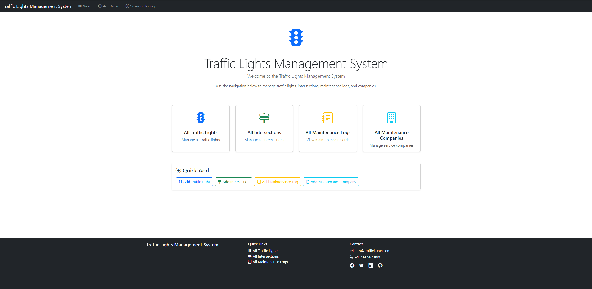
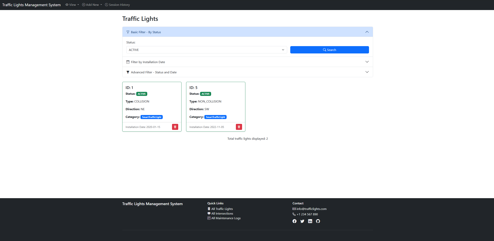
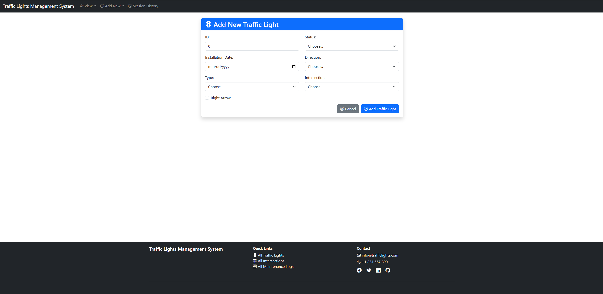

# Traffic Lights Management System

**Author:** Paweł Ryfiak ACS202
**Email:** pawel.ryfiak@student.kdg.be
**Course:** Programming 5

---

## 📚 Documentation

- [Domain Model](docs/DOMAIN.md)
- [Architecture & Project Structure](docs/ARCHITECTURE.md)
- [Setup & Getting Started](docs/SETUP.md)
- [REST API](docs/API.md)

---

## 🌟 Overview

A web application for managing traffic lights, intersections, maintenance schedules, and maintenance companies in an urban traffic control system.

The system allows users to:
- View and manage all traffic lights across the city
- Track intersections and their connected traffic lights
- Schedule and record maintenance activities
- Manage relationships with maintenance companies

---

## 📸 Application Screenshots

### Home Page

### Traffic Lights Management

### Filtering & Details

---

## Week 2

GET and DELETE REST endpoints for traffic lights. See [REST API — Week 2](docs/API.md#week-2--get--delete-endpoints).

---

## Week 3

POST and PATCH REST endpoints for traffic lights with validation and AJAX integration. See [REST API — Week 3](docs/API.md#week-3--post--patch-endpoints).

---

## Week 4

Spring Security with form-based login, BCrypt password hashing, and content-based authorization.

### Users

| Username | Password  |
|----------|-----------|
| `user`   | `user123` |

### Pages

- 🌍 **Public page** (accessible by anyone): [Traffic Light Details](http://localhost:8080/trafficLight/1)
  - Anonymous users see basic traffic light info and a teaser prompting login to view the maintenance history.
  - Authenticated users see the full maintenance log section.
- 🔒 **Authenticated page** (login required): [Traffic Lights List](http://localhost:8080/trafficLights)

---

**Last Updated:** March 8, 2026
