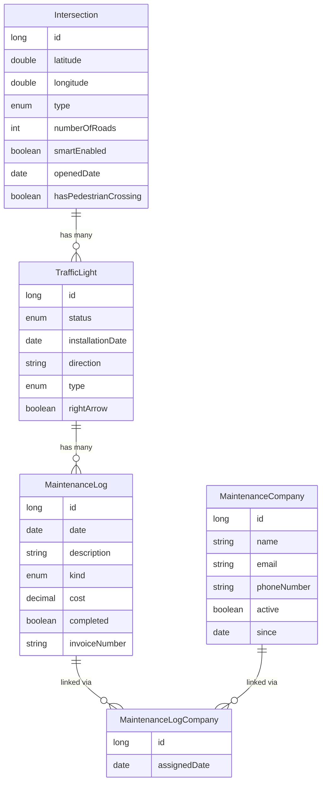
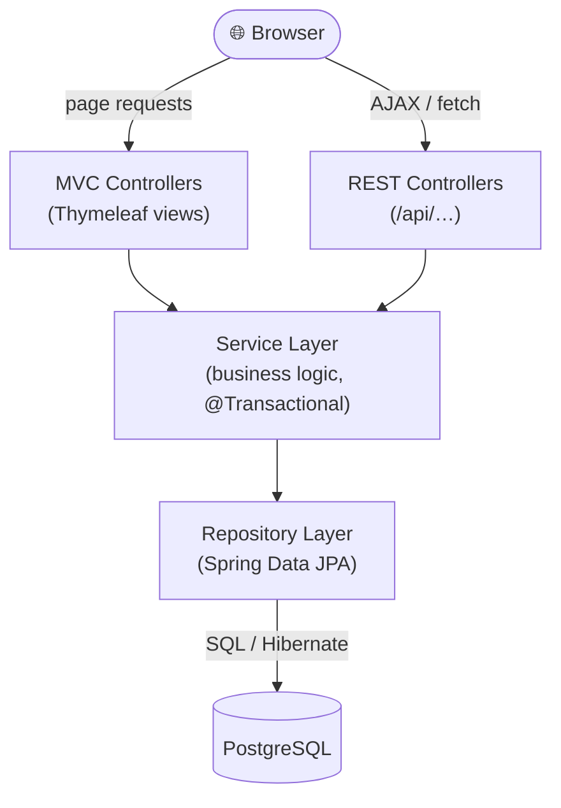
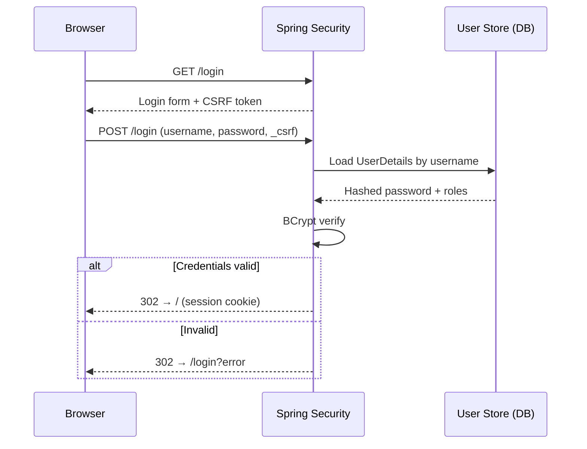
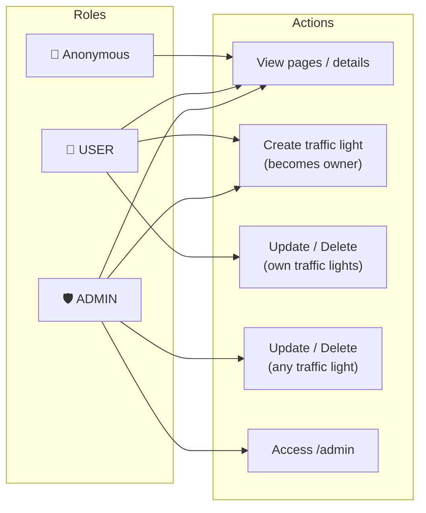
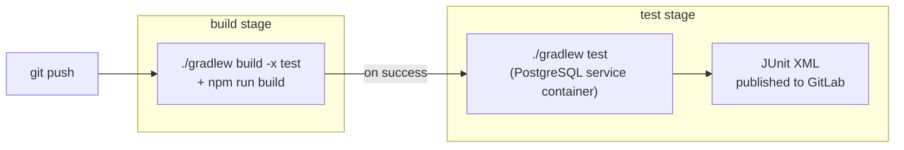
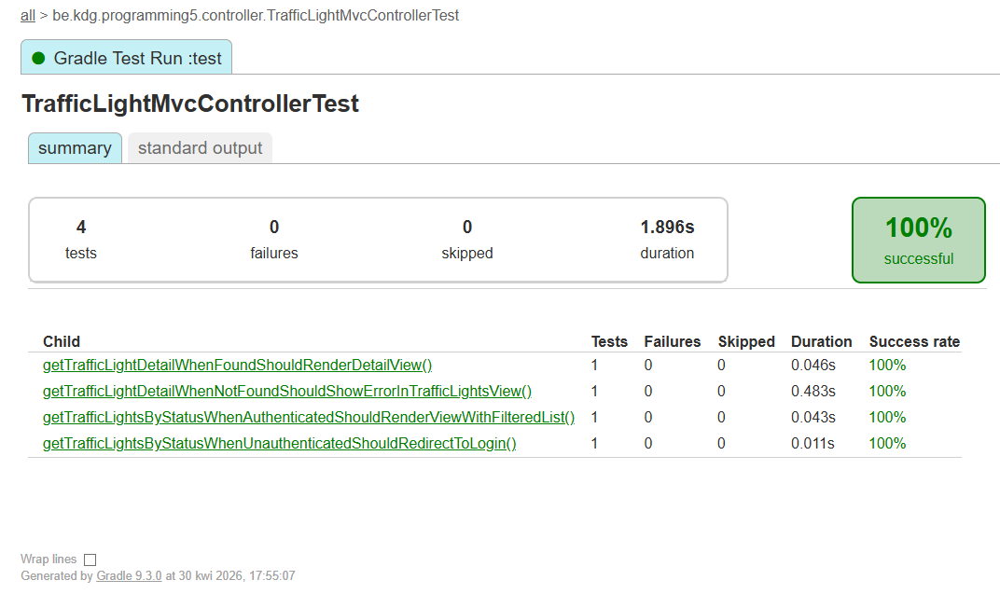

# Traffic Lights Management System

**Author:** Paweł Ryfiak ACS202
**Email:** pawel.ryfiak@student.kdg.be
**Course:** Programming 5

---

## 📚 Documentation

- [Domain Model](docs/DOMAIN.md)
- [Architecture & Project Structure](docs/ARCHITECTURE.md)
- [Setup & Getting Started](docs/SETUP.md)
- [REST API](docs/API.md)

---

## 🌟 Overview

A web application for managing traffic lights, intersections, maintenance schedules, and maintenance companies in an urban traffic control system.

The system allows users to:
- View and manage all traffic lights across the city
- Track intersections and their connected traffic lights
- Schedule and record maintenance activities
- Manage relationships with maintenance companies

### Domain Model



### Application Architecture



---

## 📸 Application Screenshots

### Home Page


### Traffic Lights Management


### Filtering & Details


---

## Week 2

GET and DELETE REST endpoints for traffic lights. See [REST API — Week 2](docs/API.md#week-2--get--delete-endpoints).

---

## Week 3

POST and PATCH REST endpoints for traffic lights with validation and AJAX integration. See [REST API — Week 3](docs/API.md#week-3--post--patch-endpoints).

---

## Week 4

Spring Security with form-based login, BCrypt password hashing, and content-based authorization.

### Authentication Flow



### Users

| Username | Password  |
|----------|-----------|
| `admin`  | `admin123` |
| `user1`  | `user123` |
| `user2`  | `user123` |

### Pages

- 🌍 **Public page** (accessible by anyone): [Traffic Light Details](http://localhost:8080/trafficLight/1)
  - Anonymous users see basic traffic light info and a teaser prompting login to view the maintenance history.
  - Authenticated users see the full maintenance log section.
- 🔒 **Authenticated page** (login required): [Traffic Lights List](http://localhost:8080/trafficLights)

---

## Week 5

Complex authorization: roles (ADMIN/USER) + ownership-based permissions on traffic lights.

### Authorization Matrix



### Role overview (including anonymous)

- **Anonymous (not logged in)**
  - Can visit the landing page and traffic light/intersection details.
  - Cannot create, update or delete traffic lights.
- **USER**
  - Can create new traffic lights (the creator becomes the owner).
  - Can update/delete only traffic lights they own.
- **ADMIN**
  - Can update/delete any traffic light.
  - Can access the admin-only page.

### Verification links

- Public page: [Traffic Light Details](http://localhost:8080/trafficLight/1)
- Admin-only page: [Admin](http://localhost:8080/admin)
- Ownership rules (example): [Traffic Light Details #1](http://localhost:8080/trafficLight/1)
  - The details page shows the traffic light owner.
  - Delete actions are hidden unless you are the owner or an admin.

### CSRF + REST/Ajax

CSRF protection is enabled.

- MVC forms include CSRF tokens automatically.
- Ajax calls to the REST API read the CSRF token + header name from Thymeleaf meta tags and send it as a request header
   (Spring typically uses `X-CSRF-TOKEN`, but the client uses the server-provided header name).

---

## Week 6

Spring profiles for test isolation and integration tests for the repository and service layers.

### Spring profiles

| Profile | Database | Seeding | Purpose |
|---------|----------|---------|---------|
| *(default)* | PostgreSQL `localhost:5432/trafficlights` | `data.sql` | Development / production |
| `test` | PostgreSQL `localhost:9432/programming5` | `@BeforeEach` only | Automated tests |

The `test` profile (`application-test.properties`) disables `data.sql` via `spring.sql.init.mode=never` and uses `ddl-auto=create-drop` so every test run starts with a clean schema. Tests seed their own data in `@BeforeEach` and clean up in `@AfterEach`.

The test database host is configurable via the `CI_DB_HOST_PORT` environment variable (defaults to `localhost:9432`), so the same profile works locally and in CI.

---

## Week 8 & 9

Presentation layer integration tests and CI pipeline.

### Running all tests

Make sure Docker is running and the test database container is up before executing:

```bash
docker-compose up -d
```

Then run all tests with a single command:

```bash
# Windows
.\gradlew.bat test

# Linux / macOS
./gradlew test
```

The `test` Spring profile is activated automatically via `@ActiveProfiles("test")` on every test class — no extra flags needed.

Test reports are generated at `build/reports/tests/test/index.html`.

### Test classes

| Category | Class | Tests |
|---|---|---|
| API integration tests (mocking) | `TrafficLightsControllerUnitTest` | `GET /api/traffic-lights` (200, 204, 401), `GET /api/traffic-lights/{id}` (200, 404, 401) |
| MVC integration tests (mocking) | `TrafficLightMvcControllerTest` | `GET /trafficLights?status` (200 with filter, 302 redirect), `GET /trafficLight/{id}` (200 found, 200 not-found error view) |
| Service unit tests (mocking + verify) | `TrafficLightServiceUnitTest` | `getAllTrafficLights` (list, empty, verify repo call), `getTrafficLightById` (found, not-found, verify ID arg) |
| Role verification tests | `TrafficLightServiceIntegrationTest` | `deleteTrafficLight` (owner ✓, admin ✓, non-owner ✗, not-found ✗), `updateTrafficLight` (owner ✓, admin ✓, non-owner ✗, not-found ✗) |
| Repository tests | `TrafficLightRepositoryTest` | Delete cascade, nullability, lazy vs eager loading |

### CI Pipeline

The project uses a GitLab CI pipeline defined in `.gitlab-ci.yml` with two stages:

- **build** — compiles the project and caches dependencies (`./gradlew build -x test`)
- **test** — runs all tests against a PostgreSQL service container (`./gradlew test`), publishes JUnit XML results to the GitLab Tests tab



**TODO: add pipeline screenshot after pushing to GitLab.**
### Code coverage


---

## Week 10 & 11

Frontend integration: npm, webpack, and a rich client-side library stack served by Spring Boot.

### Setup

Node.js (v20+) is required to build the frontend assets.

```bash
# Install all JS/CSS dependencies
npm install

# Build all webpack bundles (outputs to src/main/resources/static)
npm run build

# Lint JavaScript source files
npm run lint

# Check code formatting (dprint)
npm run format
```

### Webpack build pipeline


The Gradle build automatically runs `npm run build` via the `npmBuild` task, so running `./gradlew build` alone is sufficient for a full backend + frontend build.

### Frontend library stack

| Package | Purpose |
|---|---|
| **Bootstrap 5** | Responsive grid, components, and utility classes |
| **Bootstrap Icons** | SVG icon set (edit, delete, status indicators) |
| **@popperjs/core** | Tooltip/popover positioning — peer dep for Bootstrap |
| **anime.js** | CSS animation for traffic-light status transitions |
| **axios** | HTTP client with CSRF token interceptor for all REST calls |
| **flatpickr** | Cross-browser calendar date-picker (replaces `<input type="date">`) |
| **Quill** | Snow-themed rich-text editor for maintenance log descriptions |
| **luxon** | Full date/time library with timezone support for the live refresh counter |
| **RxJS** | `BehaviorSubject`-based auto-refresh interval on intersection details |
| **Chart.js** | Canvas charting for the intersection statistics dashboard |
| **dayjs** | Compact formatting utility for date values in list views |
| **lodash** | Utility helpers: deep clone, `groupBy`, `debounce` |
| **validator.js** | `isFloat` range checks for coordinate fields in form validation |
| **zod** | Schema-based parsing and type-narrowing of API responses |

### Webpack entry points

Each entry generates one `.js` bundle and (where CSS is imported) one `.css` bundle under `src/main/resources/static/`:

| Entry | Loaded on |
|---|---|
| `bundle-site` | Every page (Bootstrap, icons, shared styles) |
| `bundle-form-validation` | All form pages — flatpickr date pickers + coordinate validation |
| `bundle-quill-editor` | Add maintenance log page — Quill rich-text editor |
| `bundle-intersection-details` | Intersection details page — Chart.js, luxon, RxJS auto-refresh |
| `bundle-traffic-light-details` | Traffic light details page — anime.js status animation |

---

**Last Updated:** May 18, 2026
